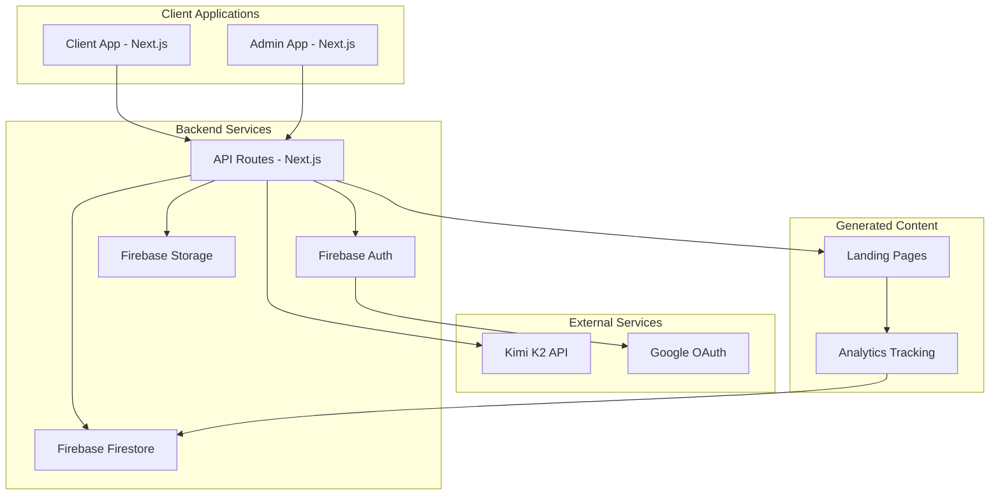

# Design Document

## Overview

AI Landing Page Generator, modern bir SaaS platformu olarak tasarlanmış, kullanıcıların AI destekli landing page'ler oluşturmasını sağlayan kapsamlı bir sistemdir. Platform, Kimi K2 AI entegrasyonu, Firebase backend, Next.js frontend ve shadcn/ui ile modern bir kullanıcı deneyimi sunar.

## Architecture

### High-Level Architecture



### Project Structure

```
ai-landing-page-generator/
├── backend/
│   ├── api/
│   │   ├── auth/
│   │   ├── landing-pages/
│   │   ├── analytics/
│   │   └── admin/
│   ├── services/
│   │   ├── kimiService.js
│   │   ├── firebaseService.js
│   │   └── analyticsService.js
│   ├── middleware/
│   └── utils/
├── frontend/
│   ├── client-app/          # Kullanıcı uygulaması
│   │   ├── components/
│   │   ├── pages/
│   │   ├── hooks/
│   │   ├── contexts/
│   │   └── styles/
│   └── admin-app/           # Admin uygulaması
│       ├── components/
│       ├── pages/
│       ├── hooks/
│       └── contexts/
├── shared/
│   ├── components/          # Ortak bileşenler
│   ├── utils/
│   └── constants/
└── generated-pages/         # Oluşturulan landing page'ler
```

## Components and Interfaces

### Core Components

#### 1. Authentication System
- **Firebase Authentication** ile Google OAuth entegrasyonu
- JWT token yönetimi
- Kullanıcı session yönetimi
- Role-based access control (user/admin)

#### 2. AI Landing Page Generator
- **Kimi K2 API Integration**
  - Prompt processing ve validation
  - HTML/CSS/JS kod üretimi
  - Template çeşitliliği sağlama
  - Error handling ve retry logic

#### 3. Landing Page Management
- **Page Builder Service**
  - AI'dan gelen kodu işleme
  - Responsive design validation
  - Code sanitization
  - Preview generation

#### 4. Analytics & CRO System
- **Real-time Analytics**
  - Page view tracking
  - Conversion tracking
  - Bounce rate calculation
  - Time on page measurement
- **CRO Analysis**
  - Performance metrics calculation
  - AI-powered improvement suggestions
  - A/B testing capabilities

#### 5. Dashboard Components
- **Client Dashboard**
  - Landing page listesi
  - Performance metrics
  - Page editor/preview
  - Analytics charts
- **Admin Dashboard**
  - User management
  - System metrics
  - API usage statistics
  - Platform analytics

### API Interfaces

#### Authentication Endpoints
```javascript
POST /api/auth/google-login
GET  /api/auth/profile
POST /api/auth/logout
GET  /api/auth/verify-token
```

#### Landing Page Endpoints
```javascript
POST /api/landing-pages/generate    # AI ile sayfa oluşturma
GET  /api/landing-pages/list        # Kullanıcının sayfaları
GET  /api/landing-pages/:id         # Sayfa detayı
PUT  /api/landing-pages/:id         # Sayfa güncelleme
DELETE /api/landing-pages/:id       # Sayfa silme
GET  /api/landing-pages/:id/preview # Sayfa önizleme
```

#### Analytics Endpoints
```javascript
POST /api/analytics/track           # Event tracking
GET  /api/analytics/dashboard/:id   # Dashboard verileri
GET  /api/analytics/cro-suggestions # CRO önerileri
```

#### Admin Endpoints
```javascript
GET  /api/admin/users              # Kullanıcı listesi
GET  /api/admin/system-stats       # Sistem istatistikleri
GET  /api/admin/api-usage          # API kullanım verileri
```

## Data Models

### User Model
```javascript
{
  uid: string,              // Firebase UID
  email: string,
  displayName: string,
  photoURL: string,
  role: 'user' | 'admin',
  createdAt: timestamp,
  lastLoginAt: timestamp,
  subscription: {
    plan: 'free' | 'pro' | 'enterprise',
    status: 'active' | 'cancelled',
    expiresAt: timestamp
  }
}
```

### Landing Page Model
```javascript
{
  id: string,
  userId: string,
  title: string,
  prompt: string,
  generatedCode: {
    html: string,
    css: string,
    javascript: string
  },
  status: 'draft' | 'published' | 'archived',
  url: string,              // Canlı sayfa URL'i
  createdAt: timestamp,
  updatedAt: timestamp,
  analytics: {
    views: number,
    conversions: number,
    bounceRate: number,
    avgTimeOnPage: number
  },
  aiMetadata: {
    model: 'kimi-k2',
    version: string,
    processingTime: number,
    tokens: number
  }
}
```

### Analytics Event Model
```javascript
{
  id: string,
  pageId: string,
  eventType: 'view' | 'conversion' | 'bounce' | 'interaction',
  timestamp: timestamp,
  userAgent: string,
  referrer: string,
  sessionId: string,
  metadata: object         // Event'e özel ek veriler
}
```

## Error Handling

### API Error Responses
```javascript
{
  success: false,
  error: {
    code: string,          // 'AUTH_FAILED', 'AI_ERROR', etc.
    message: string,       // Kullanıcı dostu mesaj
    details: object        // Debug bilgileri (dev mode)
  }
}
```

### Error Categories
1. **Authentication Errors** - 401, 403 status codes
2. **AI Service Errors** - Kimi K2 API hataları
3. **Validation Errors** - 400 status codes
4. **Rate Limiting** - 429 status codes
5. **Server Errors** - 500 status codes

### Error Handling Strategy
- Client-side error boundaries
- Retry logic for AI API calls
- Graceful degradation
- User-friendly error messages
- Comprehensive logging

## Testing Strategy

### Unit Testing
- **Frontend Components** - Jest + React Testing Library
- **API Endpoints** - Jest + Supertest
- **Services** - Jest mocking
- **Utilities** - Jest

### Integration Testing
- **API Integration** - Full request/response cycle
- **Firebase Integration** - Emulator kullanımı
- **AI Service Integration** - Mock responses

### E2E Testing
- **User Flows** - Cypress
- **Landing Page Generation** - Full workflow testing
- **Authentication Flow** - Google OAuth testing

### Performance Testing
- **Page Load Times** - Lighthouse
- **API Response Times** - Load testing
- **AI Generation Speed** - Performance monitoring

## UI/UX Design Specifications

### Design System
- **Component Library**: shadcn/ui
- **Styling**: Tailwind CSS
- **Icons**: Lucide React
- **Fonts**: Inter (primary), JetBrains Mono (code)

### Theme Configuration
```javascript
// Light Theme
{
  primary: '#3b82f6',      // Blue
  secondary: '#8b5cf6',    // Purple
  accent: '#06b6d4',       // Cyan
  background: '#ffffff',
  surface: '#f8fafc',
  text: '#1e293b'
}

// Dark Theme
{
  primary: '#60a5fa',
  secondary: '#a78bfa',
  accent: '#22d3ee',
  background: '#0f172a',
  surface: '#1e293b',
  text: '#f1f5f9'
}
```

### Gradient Patterns
- **Hero Sections**: Linear gradients (primary to secondary)
- **Cards**: Subtle background gradients
- **Buttons**: Hover gradient effects
- **Borders**: Gradient borders for premium feel

### Responsive Breakpoints
- **Mobile**: 320px - 768px
- **Tablet**: 768px - 1024px
- **Desktop**: 1024px+

### Animation Guidelines
- **Page Transitions**: Smooth fade/slide effects
- **Loading States**: Skeleton loaders
- **Micro-interactions**: Hover effects, button animations
- **Data Visualization**: Animated charts and metrics

## Security Considerations

### Authentication Security
- Firebase Authentication güvenlik kuralları
- JWT token expiration yönetimi
- CSRF protection
- Rate limiting

### Data Security
- Firestore security rules
- Input validation ve sanitization
- XSS protection
- SQL injection prevention (NoSQL için)

### API Security
- API key management
- Request validation
- Response sanitization
- CORS configuration

### Generated Code Security
- HTML/CSS/JS sanitization
- Script injection prevention
- Safe code execution environment
- Content Security Policy

## Performance Optimization

### Frontend Performance
- Code splitting
- Lazy loading
- Image optimization
- Bundle size optimization

### Backend Performance
- API response caching
- Database query optimization
- CDN kullanımı
- Connection pooling

### AI Integration Performance
- Request batching
- Response caching
- Timeout handling
- Fallback mechanisms

## Deployment Architecture

### Development Environment
- Local Firebase emulators
- Hot reload development server
- Environment variables management

### Production Environment
- Vercel deployment (Next.js apps)
- Firebase hosting (generated pages)
- CDN integration
- Monitoring ve logging

### CI/CD Pipeline
- GitHub Actions
- Automated testing
- Build optimization
- Deployment automation